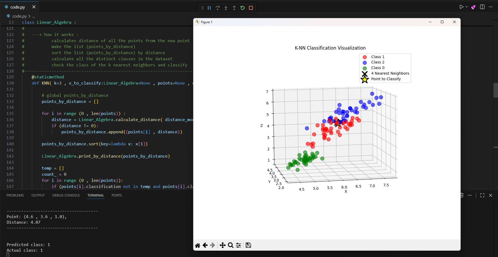

# K-Nearest Neighbors (KNN) Classifier with Linear Algebra

A Python implementation of K-NN classification emphasizing linear algebra concepts: inner products, vector representations, and distance metrics.



---

## 📦 Installation
```bash
pip install numpy pandas matplotlib scikit-learn
```

---

## 📖 Class: `Linear_Algebra`

### `__init__(x, y, z=0, classification=None)`
Creates a point object with 4 attributes: (x, y, z, classification)
- Automatically adds the object to global `points` list

### `calculate_distance(mode=0, p0, p1) -> float`
**Static method** that calculates distance between two points using different metrics.

**Modes:**
- `0`: Euclidean distance
- `1`: Manhattan Distance
- `2`: Chebyshev Distance
- `3`: Minkowski Distance
- `4`: Cosine Distance
- `5`: Squared Euclidean Distance
- `6`: Canberra Distance

### `KNN(k=3, v_to_classify, points, distance_mode=0)`
**K-Nearest Neighbors classifier**

**Inputs:**
- `k`: Number of nearest neighbors
- `v_to_classify`: Point object to classify
- `points`: List of dataset points
- `distance_mode`: Controls which distance metric to use (0-6)

**Outputs:**
- `classification`: Predicted class number
- `points_by_distance`: List of (point, distance) tuples sorted by distance

**How it works:**
1. Calculates distance from new point to all dataset points
2. Sorts points by distance
3. Finds k nearest neighbors
4. Returns most common classification among k neighbors

---

## 🚀 Usage Example
```python
from code import Linear_Algebra, load_iris_dataset, create_vectors_from_dataset

# Load and prepare dataset
X_train, X_test, y_train, y_test = load_iris_dataset()
create_vectors_from_dataset(X_train, y_train)

# Create test point and classify
test_point = Linear_Algebra(5.1, 3.5, 1.4)
predicted_class, distances = Linear_Algebra.KNN(
    k=3, 
    v_to_classify=test_point, 
    points=points, 
    distance_mode=0
)

print(f"Predicted: {predicted_class}")
```

---

## 📊 Helper Functions

### `load_iris_dataset()`
Loads Iris dataset and splits into train/test sets (80/20)

### `create_vectors_from_dataset(X, y)`
Converts dataset arrays into `Linear_Algebra` objects

### `test_knn_accuracy(X_test, y_test, k=3, distance_mode=0)`
Tests KNN accuracy on test dataset

### `plot_points(points_by_distance, v_to_classify, k)`
Creates 3D visualization of classification results

---

## 🧮 Linear Algebra Connection

- **Vectors**: Each point is a vector in ℝ³
- **Inner Products**: `d(u,v) = √(<u-v, u-v>)`
- **Cosine Similarity**: `cos(θ) = <u,v> / (||u|| × ||v||)`

---
